<div align="center">

# 🤖 AMR Control

**Web UI untuk mengelola armada robot AMR berbasis ROS 2** — peta, station, zone, mission,
pemantauan live, akun & hak akses, ditambah Robot Agent dan layar Kiosk di setiap robot.

[](https://github.com/deenqtt/ros2-software-amr/actions/workflows/webui.yml)


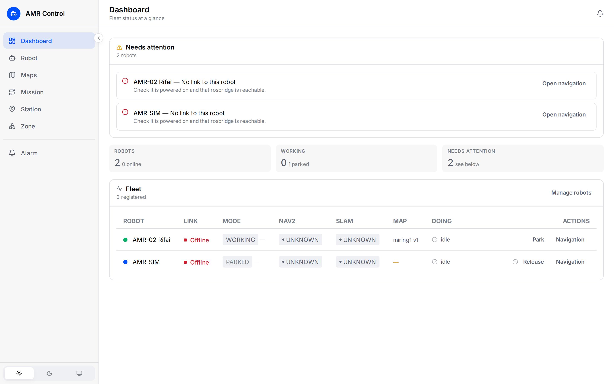

</div>

---

## Daftar Isi

- [Tentang](#tentang)
- [Tech Stack](#tech-stack)
- [Fitur](#fitur)
- [Menu & Hak Akses](#menu--hak-akses)
- [Arsitektur](#arsitektur)
- [Struktur Repository](#struktur-repository)
- [Menjalankan Secara Lokal](#menjalankan-secara-lokal)
- [Konfigurasi](#konfigurasi)
- [Robot Agent](#robot-agent)
- [Kiosk](#kiosk)
- [Pengujian](#pengujian)
- [CI & Image Docker](#ci--image-docker)
- [Deployment Produksi](#deployment-produksi)
- [Dokumentasi](#dokumentasi)
- [Status & Batasan](#status--batasan)

---

## Tentang

AMR Control adalah satu tempat untuk mengoperasikan robot AMR (Autonomous Mobile Robot):
mendaftarkan robot, membuat dan merapikan peta, menandai titik tujuan, menggambar area
larangan, menyusun rute, menjalankan mission, dan memantau hasilnya — untuk satu robot
maupun satu armada.

| Bagian | Berjalan di | Peran |
|---|---|---|
| **Web UI + Backend** (`new_webui/`) | Server (PC atau Raspberry Pi 4/5) | Antarmuka operator, akun & hak akses, *registry* (database) seluruh armada |
| **Robot Agent** (`amr_agent/`) | Setiap robot (Jetson) | Menjalankan apa yang diatur di Web UI: Nav2/SLAM, peta, station, zone, mission |
| **Kiosk** (`amr_agent/kiosk/`) | Layar di robot | Wajah robot dan layar "Pesanan Anda sudah tiba" untuk orang di sekitar robot |

> **Prinsip utama:** browser tidak "menyetir" mission. Web UI menyimpan apa yang harus dikerjakan
> ke backend; robot sendiri yang mengambil dan melaksanakannya. Menutup browser tidak menghentikan robot,
> dan robot tetap menyelesaikan mission walau server atau WiFi putus.

---

## Tech Stack

| Bagian | Teknologi |
|---|---|
| **Web UI** | Vue 3.5 · TypeScript 5.9 · Vite 7 · Tailwind CSS 3 · Pinia · Vue Router · Reka UI · roslib (rosbridge) · lucide icons · Vitest |
| **Backend** | Python 3.12 · FastAPI · Pydantic v2 · SQLite (migrasi bernomor) · session cookie HttpOnly · password scrypt · pytest · ruff |
| **Robot Agent** | Python · rclpy (ROS 2 Jazzy) · Nav2 (`navigate_to_pose`) · slam_toolbox · costmap filter dari zone |
| **Kiosk** | Python · PySide6 / Qt Quick (QML, dirender GPU) · rclpy lokal · font Plus Jakarta Sans · suara Piper / espeak-ng |
| **Deploy** | Docker (2 image multi-arch amd64 + arm64) · nginx · docker compose · GitHub Actions dengan runner ARM native · GHCR |

---

## Fitur

### 🔐 Login, akun & hak akses

- **Login** dengan username dan password; sesi berakhir setelah 12 jam tanpa aktivitas (satu shift).
- **Empat role** berjenjang — *Viewer*, *Operator*, *Admin*, *Super admin* (lihat [Menu & Hak Akses](#menu--hak-akses)).
  Tombol yang tidak boleh dipakai tetap terlihat, tapi terkunci dengan keterangan role yang dibutuhkan.
- **Super admin pertama** dibuat dari `.env` server baru, dan **wajib mengganti password** saat login pertama.
  Password sementara yang dibuat admin untuk orang lain juga wajib diganti.
- **Menu pengguna** di pojok kanan atas: nama & role, **Ganti password**, **Keluar**.
- Perlindungan: 5 kali salah password → jeda 5 menit; hanya hash token sesi yang disimpan.

<table>
  <tr>
    <td width="50%">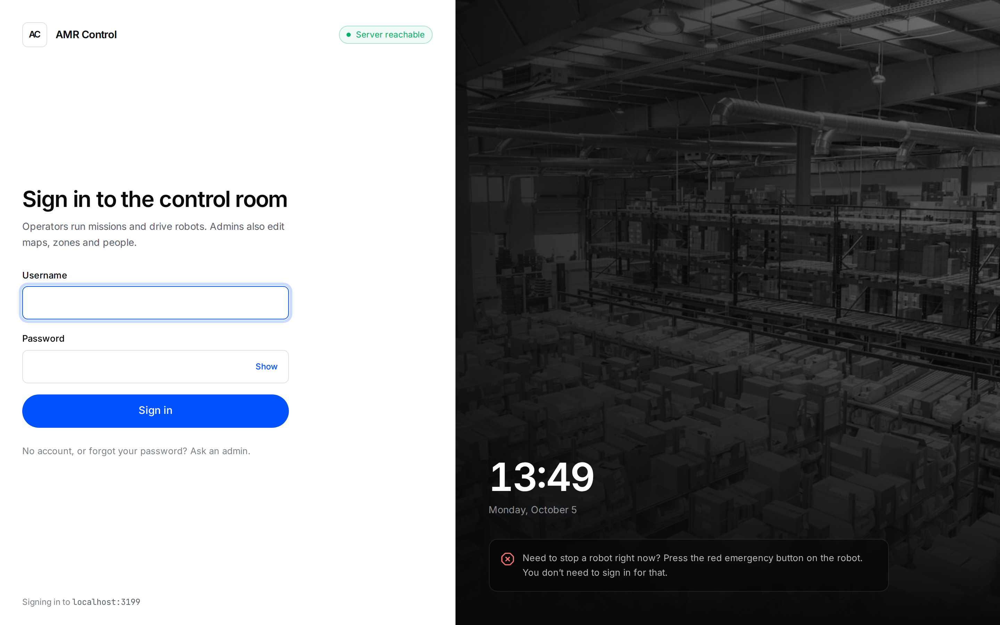</td>
    <td width="50%">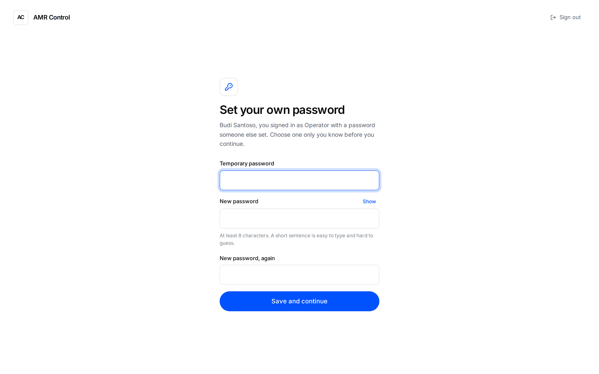</td>
  </tr>
  <tr>
    <td align="center"><sub>Halaman login (mengikuti tema terang/gelap)</sub></td>
    <td align="center"><sub>Wajib membuat password sendiri saat login pertama</sub></td>
  </tr>
  <tr>
    <td width="50%">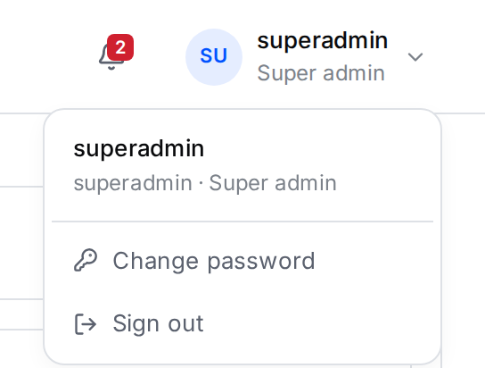</td>
    <td width="50%">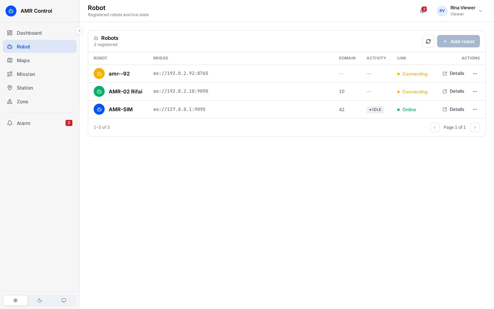</td>
  </tr>
  <tr>
    <td align="center"><sub>Menu pengguna: ganti password dan keluar</sub></td>
    <td align="center"><sub>Role <i>Viewer</i>: tombol yang tidak diizinkan terkunci</sub></td>
  </tr>
</table>

### 🧭 Navigasi live

Peta live, posisi dan laser robot, rute yang direncanakan, costmap, zone, dan marker mission
bernomor — dengan **Set pose**, **Go here**, **Cancel goal**, dan **Stop & park**
(batalkan goal + mission + parkir robot). Layer bisa dinyalakan/dimatikan satu per satu.

<table>
  <tr>
    <td width="50%">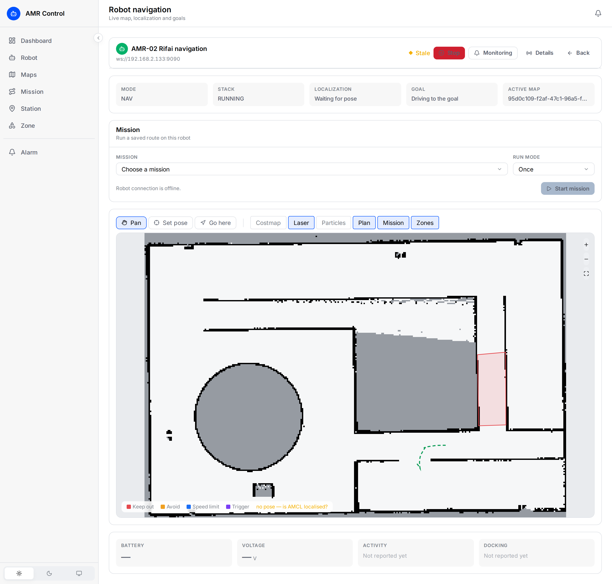</td>
    <td width="50%">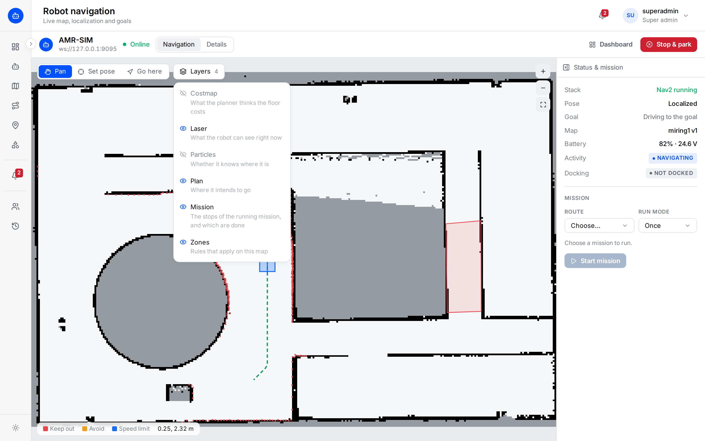</td>
  </tr>
  <tr>
    <td align="center"><sub>Halaman navigasi: robot menuju goal, status & kartu mission</sub></td>
    <td align="center"><sub>Pilihan layer: costmap, laser, partikel, rute, mission, zone</sub></td>
  </tr>
</table>

### 🗺️ Peta

- **Survey (SLAM)** — kemudikan robot dengan joystick di layar atau gamepad (tombol *deadman*), lalu simpan peta.
- **Map editor** — brush, garis, kotak, fill, undo/redo; disimpan sebagai **versi baru** (versi lama tetap aman).
- **Registry & versi** — upload `.yaml` + `.pgm/.png`, assign peta ke robot, rename, download.

<table>
  <tr>
    <td width="33%">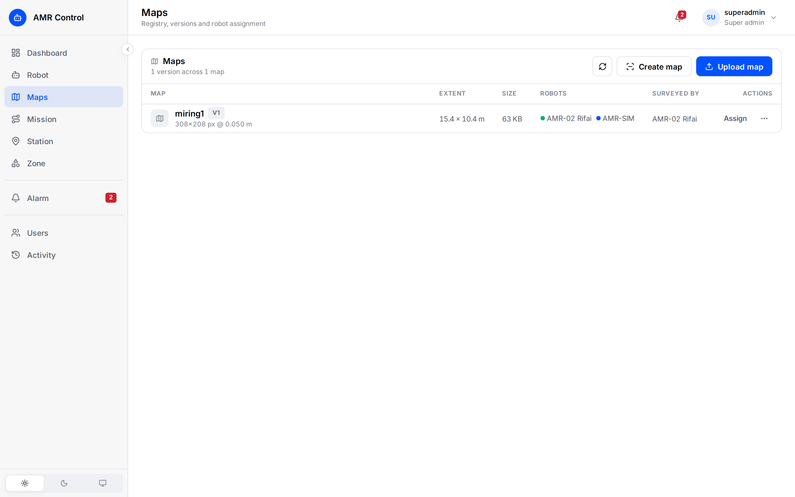</td>
    <td width="33%">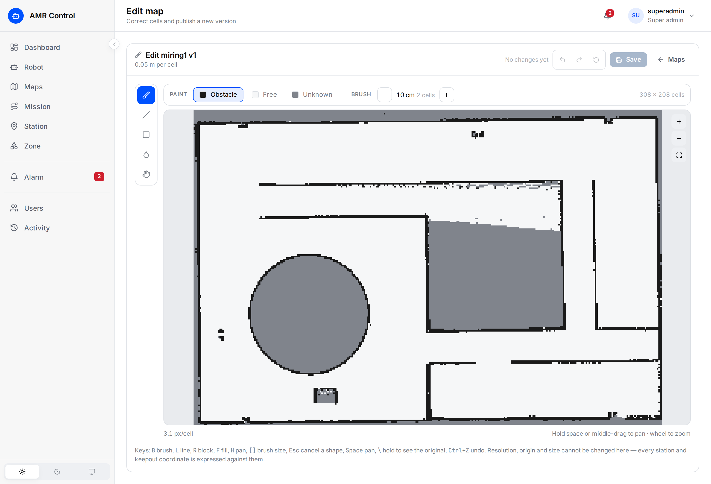</td>
    <td width="33%">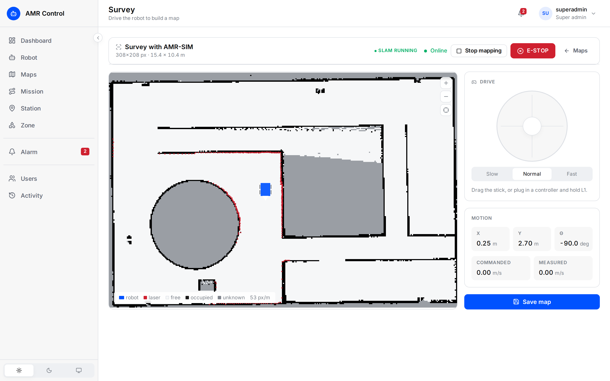</td>
  </tr>
  <tr>
    <td align="center"><sub>Daftar peta & versi</sub></td>
    <td align="center"><sub>Map editor</sub></td>
    <td align="center"><sub>Survey: membuat peta dengan SLAM</sub></td>
  </tr>
</table>

### 📍 Station, 🚧 Zone & 📋 Mission

- **Station** — titik tujuan bernama dengan arah hadap: *Pick*, *Drop*, *Pick & drop*, *Charging*. Dibuat dengan klik di peta atau **Capture** dari posisi robot.
- **Zone** — poligon aturan area yang diterapkan ke Nav2:

  | Jenis | Perilaku robot |
  |---|---|
  | 🟥 **Keep out** | Dilarang masuk, dianggap dinding |
  | 🟧 **Avoid** | Dihindari bila ada jalan lain (tingkat keengganan 1–99) |
  | 🟦 **Speed limit** | Melambat sampai batas kecepatan di dalam area |
  | 🟪 **Trigger** | Menyalakan sinyal (lampu/buzzer) selama di dalam area |

- **Mission** — rute berurutan dari beberapa station; dijalankan **Once**, **Laps**, atau **Until stopped**,
  dengan *Stop after lap*, *Cancel mission*, dan *Cancel goal*. Step bertanda **Wait for confirm** menahan robot
  sampai pesanan diambil dan dikonfirmasi di Kiosk (atau 2 menit berlalu).

<table>
  <tr>
    <td width="33%">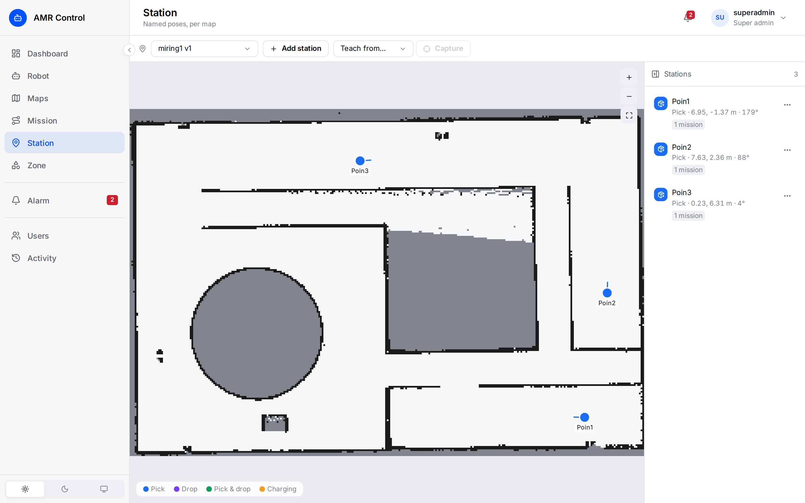</td>
    <td width="33%">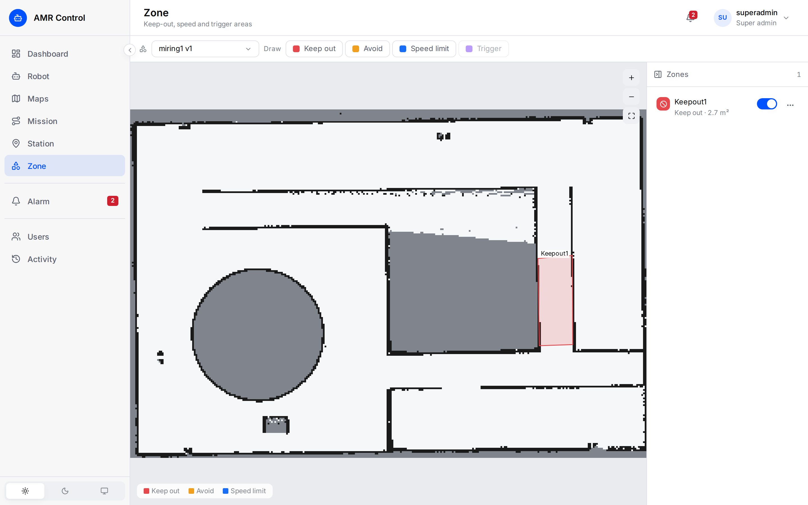</td>
    <td width="33%">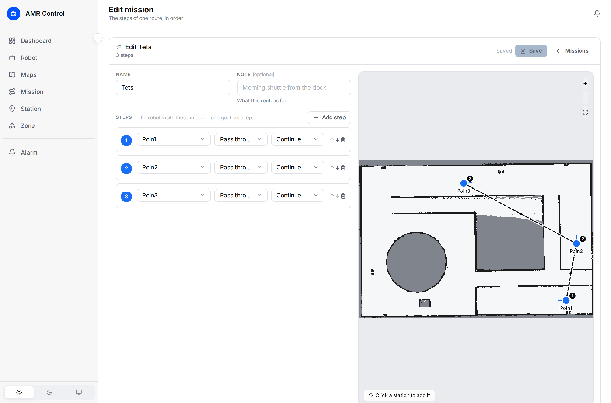</td>
  </tr>
  <tr>
    <td align="center"><sub>Station</sub></td>
    <td align="center"><sub>Zone</sub></td>
    <td align="center"><sub>Mission editor: step dan rute di peta</sub></td>
  </tr>
</table>

### 📊 Pemantauan armada & notifikasi

- **Dashboard** — semua robot sekaligus, robot bermasalah di atas (*Needs attention*), status Nav2/SLAM, mode **Working / Parked / Surveying**, tombol **Park / Release**.
- **Robot details** — kesehatan setiap topic ROS (OK / Waiting / Stale), frekuensi, terakhir diterima.
- **Notifikasi** — pop-up dan lonceng 🔔 setiap robot tiba di station, mission selesai, gagal (beserta alasannya), atau dibatalkan; riwayat lengkap di halaman **Alarm**.

<table>
  <tr>
    <td width="33%">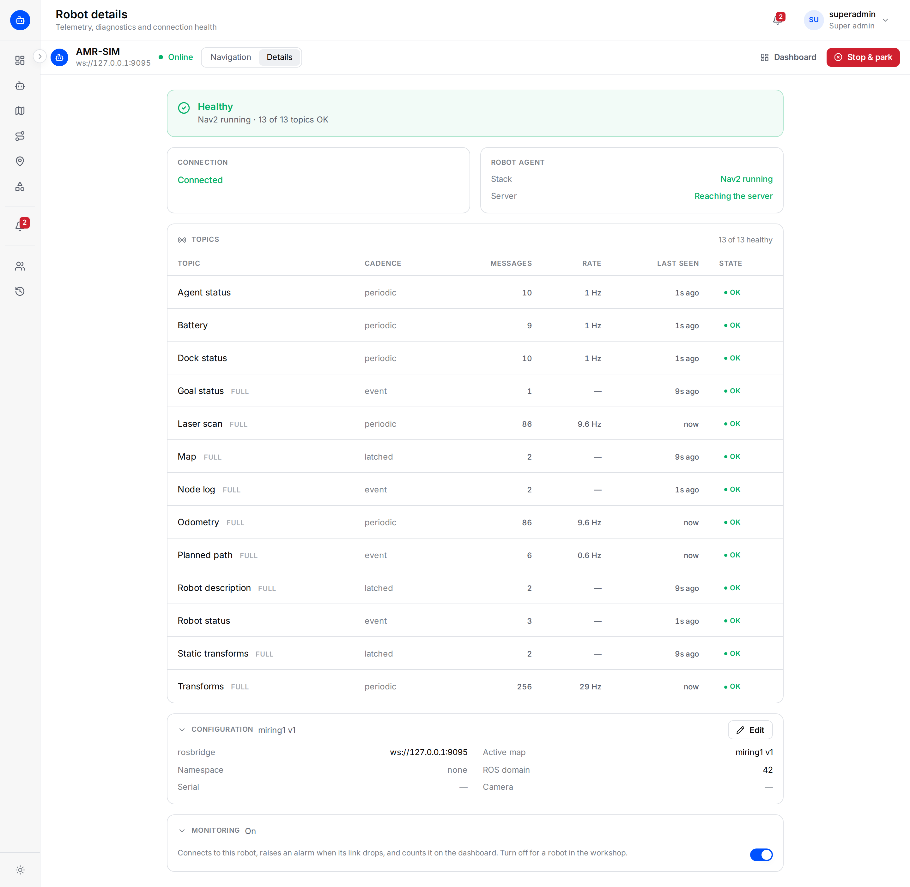</td>
    <td width="33%">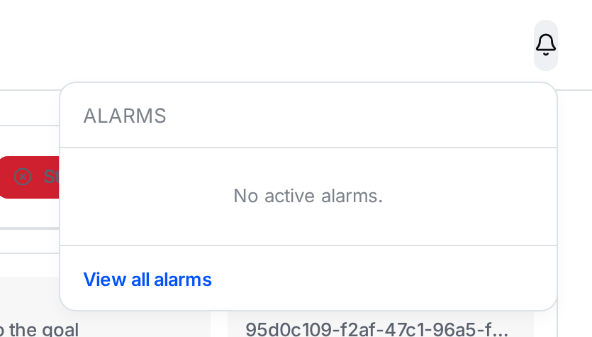</td>
    <td width="33%">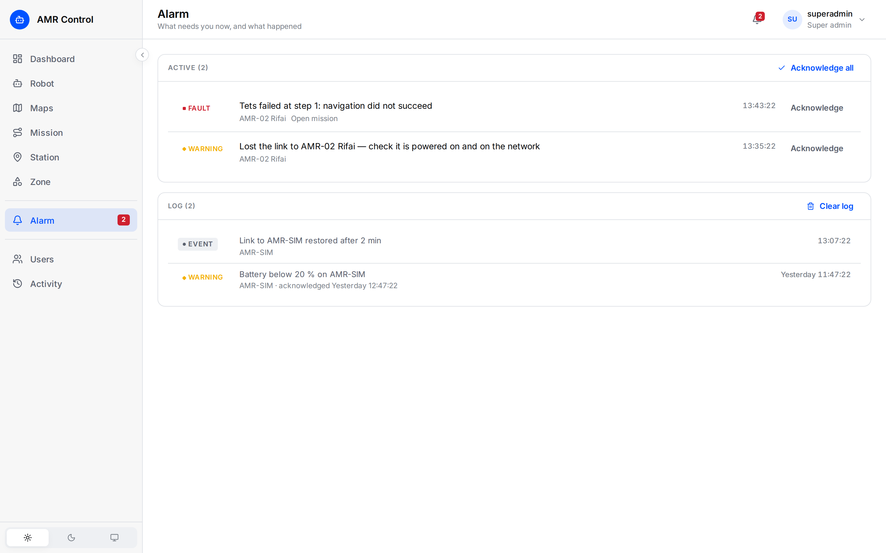</td>
  </tr>
  <tr>
    <td align="center"><sub>Kesehatan topic robot</sub></td>
    <td align="center"><sub>Lonceng notifikasi</sub></td>
    <td align="center"><sub>Halaman Alarm</sub></td>
  </tr>
</table>

### 👥 Users & 🕒 Activity (Super admin)

- **Users** — tambah akun dengan password sementara, ubah role, nonaktifkan, reset password, hapus.
  Super admin terakhir tidak bisa diturunkan, dinonaktifkan, atau dihapus.
- **Activity** — jejak audit: siapa mengubah apa dan kapan, termasuk login yang gagal dan aksi yang ditolak.
  Pencarian, filter jenis/orang/rentang waktu, pagination, dan **Export CSV**.

<table>
  <tr>
    <td width="33%">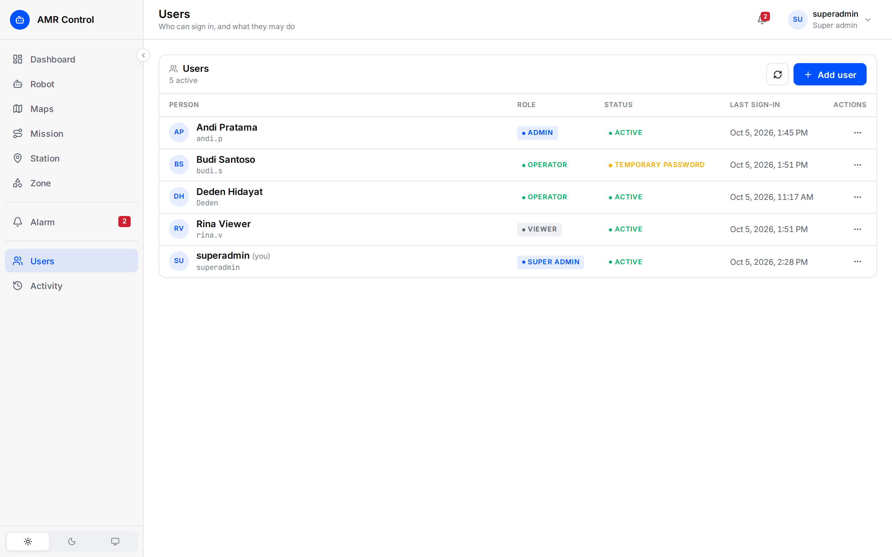</td>
    <td width="33%">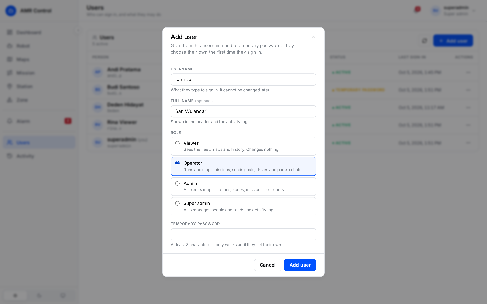</td>
    <td width="33%">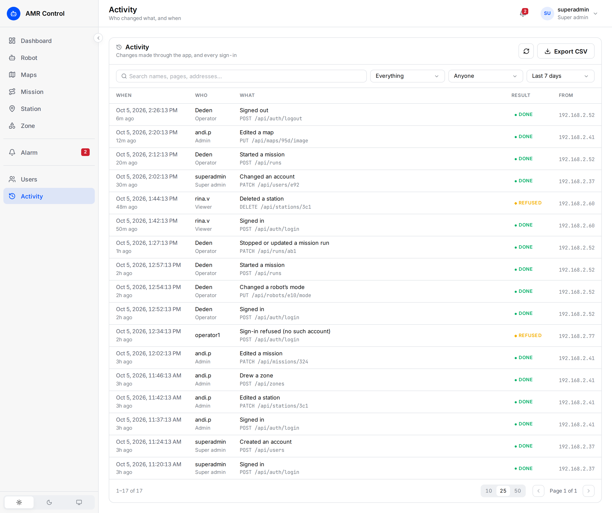</td>
  </tr>
  <tr>
    <td align="center"><sub>Daftar akun</sub></td>
    <td align="center"><sub>Tambah akun</sub></td>
    <td align="center"><sub>Activity log</sub></td>
  </tr>
</table>

### 📱 Tampilan HP & tablet

Semua halaman responsif. Di HP hanya yang penting yang tampil: menu jadi *drawer*, dialog jadi
*bottom sheet* layar penuh, tombol 44 px agar mudah disentuh, panel navigasi jadi lembar yang bisa
ditarik, dan robot bermasalah selalu di atas. Halaman yang butuh layar lebar (map editor) memberi
tahu untuk pindah ke tablet/laptop.

<table>
  <tr>
    <td width="25%">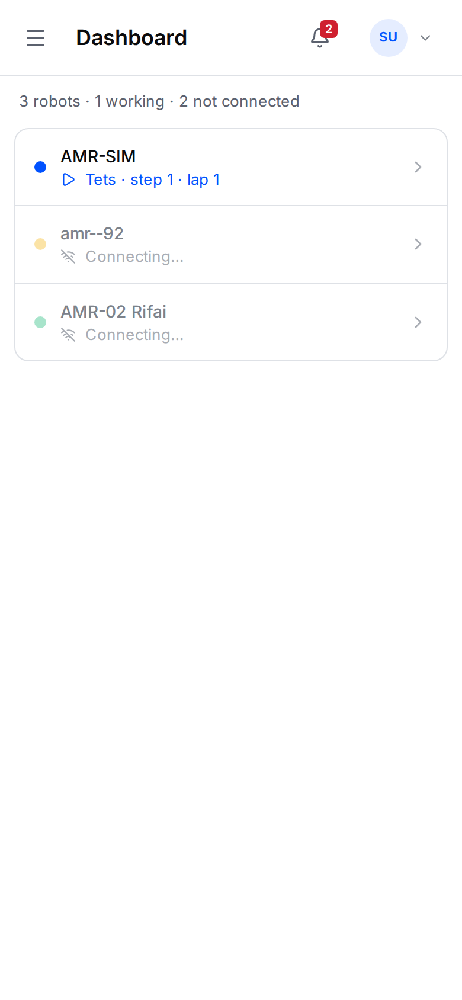</td>
    <td width="25%">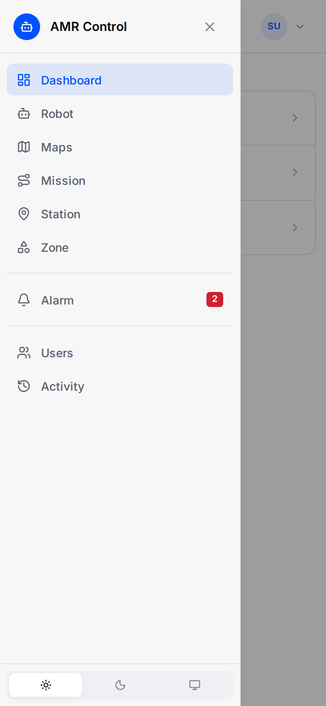</td>
    <td width="25%">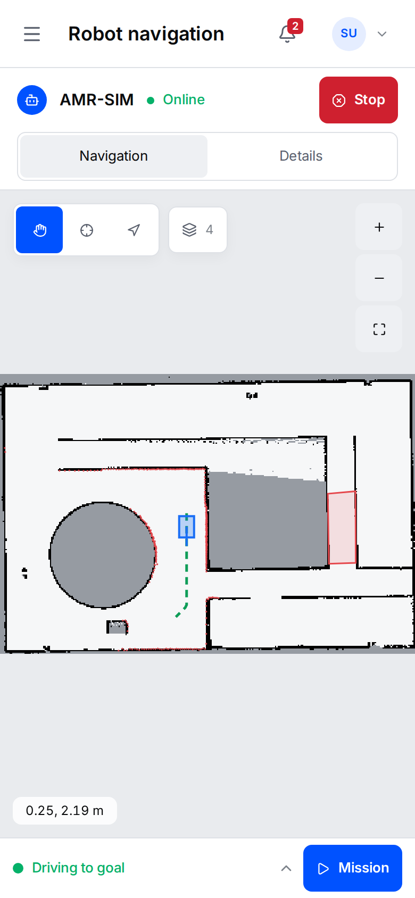</td>
    <td width="25%">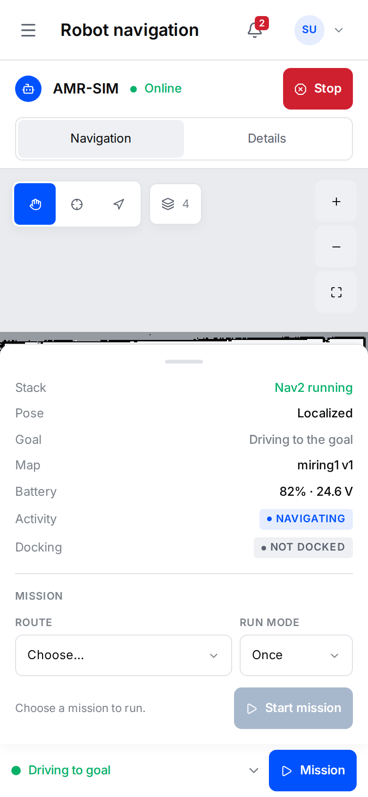</td>
  </tr>
  <tr>
    <td align="center"><sub>Dashboard</sub></td>
    <td align="center"><sub>Menu drawer</sub></td>
    <td align="center"><sub>Navigasi</sub></td>
    <td align="center"><sub>Status & mission</sub></td>
  </tr>
</table>

Semua screenshot ada di [`docs/images/web-ui/`](docs/images/web-ui/) (desktop) dan
[`docs/images/web-ui/mobile/`](docs/images/web-ui/mobile/) (HP, 390 px).

---

## Menu & Hak Akses

Setiap role mencakup hak role di bawahnya.

| Role | Bisa |
|---|---|
| **Viewer** | Melihat armada, peta, mission, dan riwayat. Tidak mengubah apa pun. |
| **Operator** | + menjalankan/menghentikan mission, mengirim goal, mengemudikan dan memarkir robot. |
| **Admin** | + mengedit peta, station, zone, mission, dan daftar robot. |
| **Super admin** | + mengelola akun (Users) dan membaca Activity log. |

| Menu | Isi | Role minimal untuk mengubah |
|---|---|---|
| **Dashboard** | Ringkasan armada, robot yang perlu perhatian, Park / Release | Operator |
| **Robot** | Daftar robot, tambah/edit robot; per robot: **Navigation** dan **Details** | Operator (navigasi) · Admin (daftar robot) |
| **Maps** | Daftar & versi peta, map editor, survey SLAM | Admin |
| **Mission** | Daftar mission, editor rute, jalankan & hentikan | Admin (edit) · Operator (jalankan) |
| **Station** | Titik tujuan per peta | Admin |
| **Zone** | Area keep out / avoid / speed limit / trigger | Admin |
| **Alarm** | Riwayat notifikasi, acknowledge | Semua role |
| **Users** | Akun dan role | Super admin (menu tersembunyi untuk role lain) |
| **Activity** | Jejak audit, export CSV | Super admin (menu tersembunyi untuk role lain) |

Hak akses dijaga di **backend**; kunci di UI hanya memberi tahu lebih awal.

---

## Arsitektur

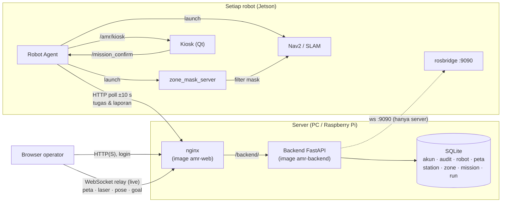
```mermaid
flowchart LR
    subgraph Server["Server (PC / Raspberry Pi)"]
        NG["nginx<br/>(image amr-web)"]
        API["Backend FastAPI<br/>(image amr-backend)"]
        DB[("SQLite<br/>akun · audit · robot · peta<br/>station · zone · mission · run")]
        NG -- "/backend/" --> API --> DB
    end

    subgraph Robot["Setiap robot (Jetson)"]
        AG["Robot Agent"]
        NAV["Nav2 / SLAM"]
        ZM["zone_mask_server"]
        RB["rosbridge :9090"]
        KI["Kiosk (Qt)"]
        AG -- launch --> NAV
        AG -- launch --> ZM
        ZM -- filter mask --> NAV
        AG -- "/amr/kiosk" --> KI
        KI -- "/mission_confirm" --> AG
    end

    B["Browser operator"] -- "HTTP(S), login" --> NG
    AG -- "HTTP poll ±10 s<br/>tugas & laporan" --> NG
    B -- "WebSocket relay (live)<br/>peta · laser · pose · goal" --> NG
    API -. "ws :9090 (hanya server)" .-> RB
```

| Jalur | Isi |
|---|---|
| **Browser → nginx → Backend** (REST, cookie sesi) | Semua data operator: robot, peta, station, zone, mission, run, akun |
| **Agent → Backend** (HTTP, robot yang menarik, dengan token agent per robot) | Peta & mode yang diminta, station, zone, run; laporan step / tiba / selesai |
| **Browser → Backend → Robot** (relay WebSocket `/backend/api/robots/<id>/ros`) | Hanya data *live*: peta, laser, pose, costmap, rute, serta *Set pose* / *Go here*. Browser tidak pernah terhubung ke rosbridge; backend memeriksa login, `Origin`, dan role (viewer: telemetri + perintah stop; operator: goal, pose awal, teleop, mulai mapping, simpan peta), lalu meneruskan ke `bridge_url` robot |
| **Agent ↔ Kiosk** (ROS lokal di robot) | Fase pengantaran untuk layar, tombol konfirmasi — tetap jalan tanpa jaringan |

Robot yang **menarik** data (bukan server yang mendorong), sehingga robot tetap bekerja walau
berada di belakang NAT atau berpindah access point WiFi.

---

## Struktur Repository

```
ros2-software-amr/
├── .github/workflows/     CI: test + build image amd64/arm64 → GHCR
├── new_webui/
│   ├── frontend/          Vue 3 + Vite + TypeScript + Tailwind + Pinia + roslib
│   │   ├── src/
│   │   │   ├── app/        shell, router, layout responsif, koneksi ROS (pool)
│   │   │   ├── features/   auth, admin (users/activity), dashboard, robot, maps,
│   │   │   │               mapping, missions, stations, zones, alarm
│   │   │   ├── domain/     tipe data, role, logika ROS (TF, status, topic health)
│   │   │   └── shared/     komponen UI, API client
│   │   ├── Dockerfile      image amr-web (nginx + hasil build)
│   │   └── nginx/          konfigurasi nginx di dalam image
│   ├── backend/           FastAPI + SQLite
│   │   ├── app/            api/, repositories/, schemas/, migrations/, auth, audit
│   │   ├── tests/          pytest
│   │   └── Dockerfile      image amr-backend
│   └── deploy/            docker-compose.yml, .env.example, contoh proxy robot & nginx
├── amr_agent/             Robot Agent + Kiosk (di-copy ke setiap robot)
│   ├── robot_agent_node.py   agent utama (rclpy)
│   ├── agent_state.py        "ingatan" offline: registry, station, zone, outbox
│   ├── backend_client.py     klien HTTP ke backend
│   ├── zone_mask_server.py   zone → mask filter Nav2
│   ├── delivery.py           tunggu konfirmasi, hampir sampai / terhalang (tanpa ROS)
│   ├── kiosk/                layar di robot (PySide6/QML)
│   ├── tests/                test tanpa ROS (pytest)
│   ├── deploy/               install_robot.sh, push_to_robot.sh, service systemd
│   ├── requirements.txt      paket pip (PySide6 untuk kiosk)
│   └── run_agent_gprp.sh     peluncur agent (+ --kiosk)
└── docs/                  dokumentasi
    ├── brand/             logo AMR Control (SVG) dan logo GSPE
    ├── design/            DESIGN.md (design system Web UI), mockup kiosk & halaman error nginx
    ├── manual/            sumber panduan PDF
    ├── runbooks/          deploy produksi
    └── images/            screenshot Web UI dan kiosk
```

---

## Menjalankan Secara Lokal

### Prasyarat

- **Python 3.12+** (backend) dan **Node.js 20+** (frontend)
- Robot atau simulasi ROS 2 dengan **rosbridge** di port 9090 (untuk data live)

### 1. Backend — `http://localhost:3002`

```bash
cd new_webui/backend
python3 -m venv .venv
./.venv/bin/pip install -e ".[dev]"
cp .env.example .env     # isi AMR_BOOTSTRAP_USER / AMR_BOOTSTRAP_PASSWORD untuk akun pertama
./.venv/bin/python -m app --reload
```

Migrasi database berjalan otomatis saat start. Dokumentasi API: `http://localhost:3002/docs`.
Alternatif tanpa `.env`: `./.venv/bin/python -m app create-admin <username>`.

### 2. Frontend — `http://localhost:3100`

```bash
cd new_webui/frontend
npm install
cp .env.example .env
npm run dev
```

### 3. Login & tambahkan robot

Login dengan akun super admin, buat password sendiri, lalu **Robot** → **Add robot**: isi nama dan
alamat rosbridge (mis. `ws://192.168.2.133:9090`), lalu jalankan [Robot Agent](#robot-agent) di robot
dengan ID yang ditampilkan.

---

## Konfigurasi

### Backend — `new_webui/backend/.env`

| Variabel | Default | Keterangan |
|---|---|---|
| `AMR_DB_PATH` | `./data/amr.db` | Lokasi database SQLite |
| `AMR_MAPS_DIR` | `./data/maps` | Lokasi file peta |
| `AMR_HOST` / `AMR_PORT` | `0.0.0.0` / `3002` | Alamat server |
| `AMR_CORS_ORIGINS` | `http://localhost:3100` | Origin browser yang diizinkan (pisahkan dengan koma) |
| `AMR_ENV` | `development` | `production` menolak start bila CORS tidak aman |
| `AMR_SESSION_IDLE_MINUTES` | `720` | Sesi berakhir setelah sekian menit tanpa aktivitas |
| `AMR_COOKIE_SECURE` | `false` | `true` hanya bila situs memakai HTTPS |
| `AMR_ALLOW_INSECURE_HTTP` | `false` | Production menolak start bila `AMR_COOKIE_SECURE=false`, kecuali ini `true` (HTTP polos dipilih secara sadar, mis. jaringan uji tertutup) |
| `AMR_AGENT_AUTH` | `required` | Agent wajib membawa token per robot (Robot → Details → Agent token). `optional` hanya untuk development; production menolak start bila `optional` |
| `AMR_AUDIT_RETENTION_DAYS` | `365` | Catatan Activity yang lebih lama dihapus saat start |
| `AMR_BOOTSTRAP_USER` / `AMR_BOOTSTRAP_PASSWORD` | — | Super admin pertama, hanya dipakai saat database belum punya akun |

### Frontend — `new_webui/frontend/.env`

| Variabel | Contoh | Keterangan |
|---|---|---|
| `VITE_API_BASE_URL` | `/backend/api` | Alamat API (lewat proxy dev server / nginx, satu origin) |
| `VITE_API_STATIC_URL` | `/backend` | Alamat file statis backend (gambar peta) |
| `VITE_DEV_BACKEND` | `http://localhost:3002` | Tujuan proxy `/backend` saat `npm run dev` |
| `VITE_DEFAULT_ROS_URL` | `ws://localhost:8765` | Isian awal form *Add robot* |
| `VITE_SITE_NAME` | `Plant 1 · Warehouse A` | Ditampilkan di halaman login (opsional) |

---

## Robot Agent

Program kecil di setiap robot yang menjadi penghubung antara Web UI dan robot.

**Yang dilakukan setiap ±10 detik:**

1. Membaca registry: peta yang ditugaskan dan mode yang diminta (*Working / Parked / Surveying*).
2. Mengirim laporan yang tertunda (bila sebelumnya offline).
3. Mengunduh & memverifikasi peta (hash), menyimpannya di cache robot.
4. Menyalakan/mematikan Nav2 atau SLAM sesuai mode; `zone_mask_server` ikut menyala bersama Nav2.
5. Menyimpan station & zone ke disk robot dan meneruskan zone ke Nav2.
6. Mengambil dan menjalankan mission, melaporkan setiap step, tiba, selesai, gagal (beserta alasannya), atau batal.

**Konfirmasi pengambilan** (`mission_via=nav`): di step bertanda *confirm* robot menunggu tombol
**Sudah diambil** di Kiosk (service `/mission_confirm`) sampai `confirm_timeout` (default 120 detik),
lalu lanjut sendiri. Status pengantaran untuk layar dikirim di topic `/amr/kiosk`.

**Tahan server mati:** robot menyimpan "ingatan" di `~/amr_agent/state/` —
boot dari registry & peta cache bila server tidak terjangkau, laporan masuk antrean dan dikirim
berurutan saat koneksi kembali, dan run yang sudah selesai tidak pernah dijalankan dua kali.

### Instalasi di robot

Satu perintah dari laptop: `./amr_agent/deploy/push_to_robot.sh <user>@<ip-robot> --robot-id … --backend …`
— memasang agent dan kiosk sebagai service. Langkah lengkap: [Deployment Produksi](#deployment-produksi), langkah ④.

> `run_agent_gprp.sh` saat ini disetel untuk simulasi **Isaac Sim** (`*_sim_launch.py`, `use_sim_time:=true`).
> Robot fisik memerlukan paket launch-nya sendiri dan `use_sim_time_arg:=false`.

### Banyak robot

Setiap robot menjalankan agent sendiri dengan **robot ID unik**, rosbridge sendiri, dan sebaiknya
**`ROS_DOMAIN_ID` berbeda**. Banyak robot boleh memakai versi peta yang sama — station dan zone
peta itu otomatis berlaku untuk semuanya. Satu robot menjalankan satu mission pada satu waktu.

---

## Kiosk

Layar di robot untuk orang di sekitarnya: wajah robot beranimasi, tujuan dan rute, dan layar
**"Pesanan Anda sudah tiba"** dengan satu tombol besar. Aplikasi **PySide6/Qt Quick** yang berjalan
di robot itu sendiri dan membaca ROS secara lokal — tetap jalan walau WiFi atau server putus.

<table>
  <tr>
    <td width="33%">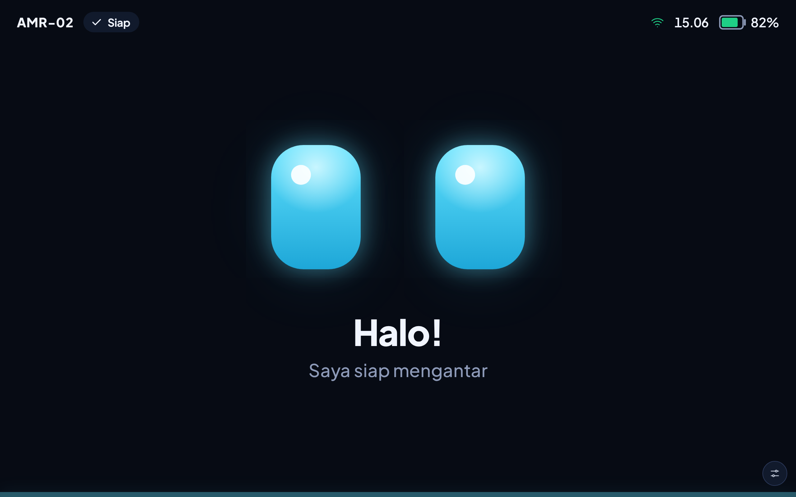</td>
    <td width="33%">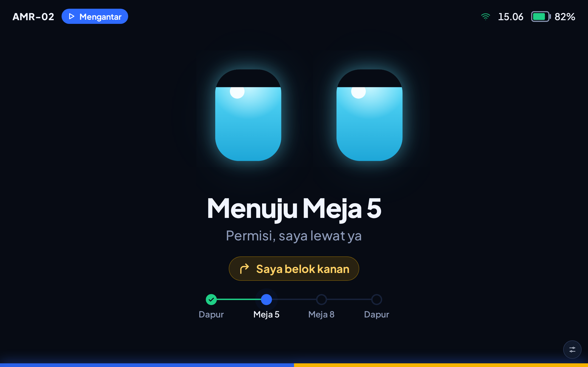</td>
    <td width="33%">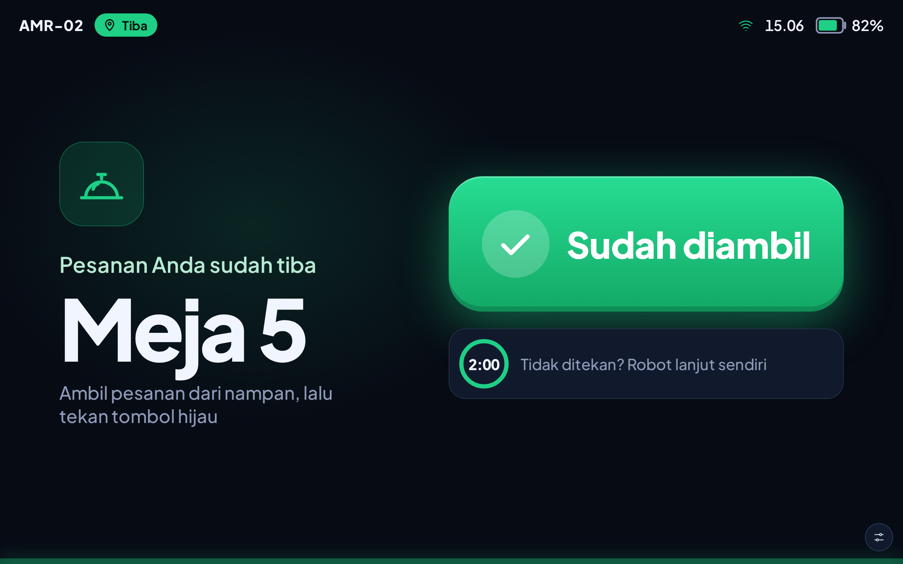</td>
  </tr>
  <tr>
    <td align="center"><sub>Siap — mata melirik dan mengikuti sentuhan</sub></td>
    <td align="center"><sub>Mengantar — tujuan, rute, sinyal belok</sub></td>
    <td align="center"><sub>Tiba — tombol konfirmasi, hitung mundur 2 menit</sub></td>
  </tr>
  <tr>
    <td width="33%">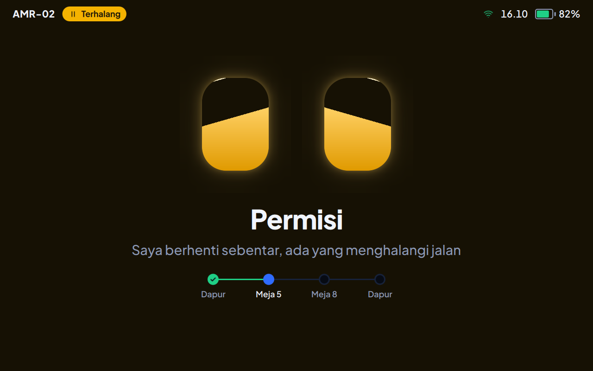</td>
    <td width="33%">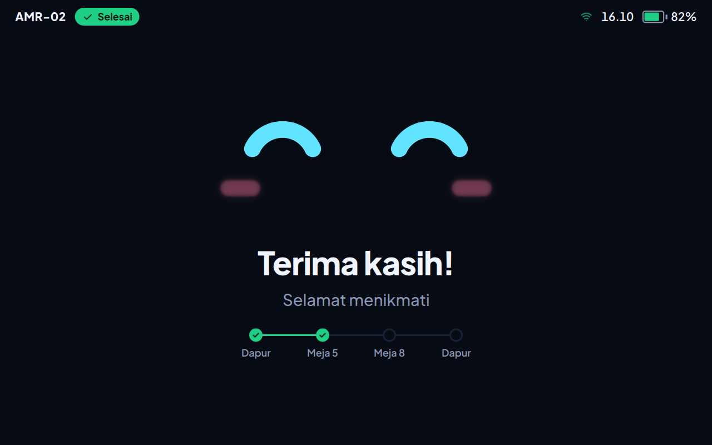</td>
    <td width="33%">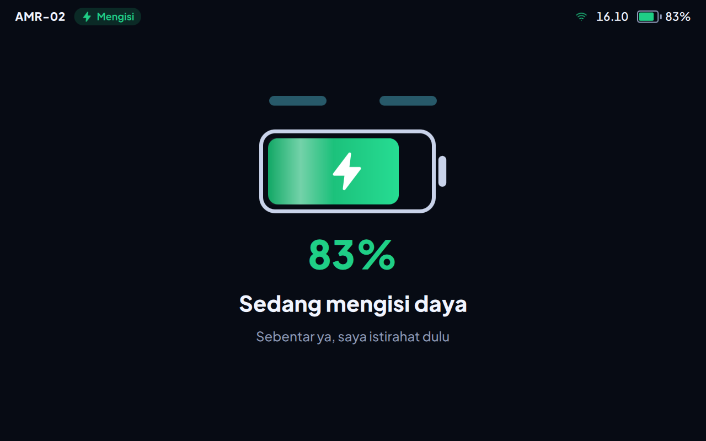</td>
  </tr>
  <tr>
    <td align="center"><sub>Terhalang — "Permisi"</sub></td>
    <td align="center"><sub>Terima kasih — sebelum lanjut ke stop berikutnya</sub></td>
    <td align="center"><sub>Mengisi daya</sub></td>
  </tr>
  <tr>
    <td width="33%">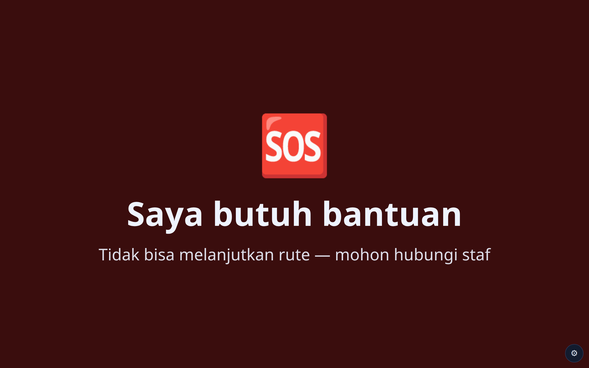</td>
    <td width="33%">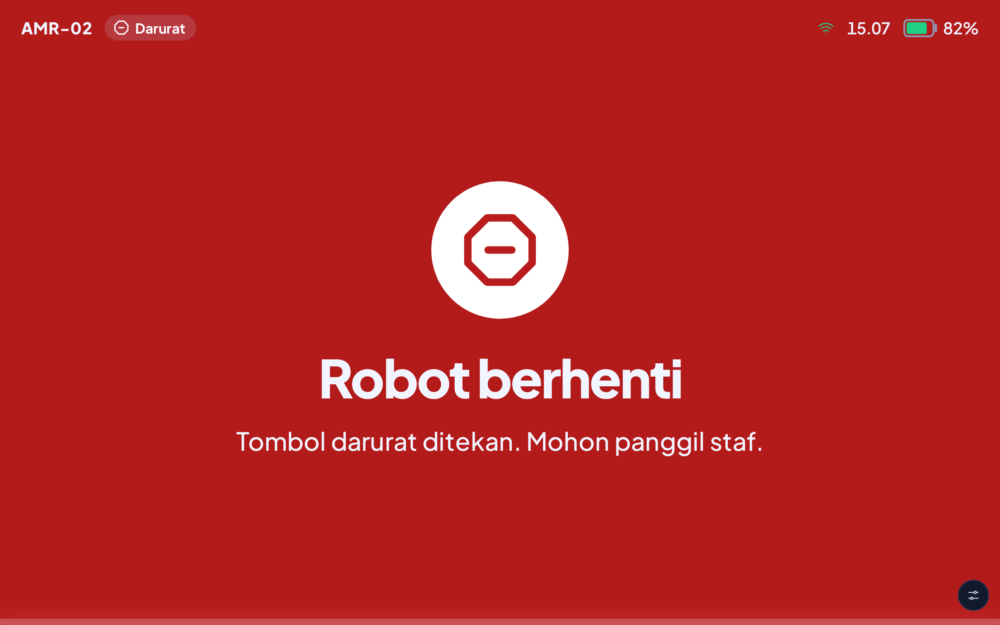</td>
    <td width="33%">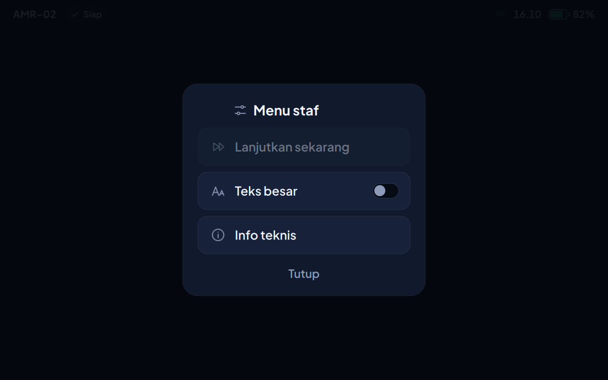</td>
  </tr>
  <tr>
    <td align="center"><sub>Butuh bantuan — beserta alasan untuk staf</sub></td>
    <td align="center"><sub>E-STOP</sub></td>
    <td align="center"><sub>Menu staf (tahan pojok kiri atas + PIN)</sub></td>
  </tr>
</table>

- **Wajah**: kelopak mata bergeser untuk tiap ekspresi (fokus, semangat, senang, cemas, sebal, ngantuk), berkedip acak, tertawa saat disentuh.
- **Suara**: chime per kejadian dan kalimat ("Pesanan untuk Meja 5 sudah tiba…") lewat Piper/espeak-ng bila terpasang; pengingat saat 30 detik tersisa.
- **Menu staf** (PIN): *Lanjutkan sekarang*, *Teks besar*, *Info teknis*.
- Bahasa Indonesia / Inggris; landscape dan portrait.

```bash
pip install PySide6
python3 amr_agent/kiosk/kiosk_app.py --mock --window     # coba tanpa ROS: tombol 1–9, L, S
./amr_agent/run_agent_gprp.sh --kiosk <robot_id> <backend_url>   # di robot, bersama agent
```

Detail opsi, topic, dan suara: [`amr_agent/kiosk/README.md`](amr_agent/kiosk/README.md).
Desain awalnya (HTML statis) ada di [`docs/design/kiosk-mockup/`](docs/design/kiosk-mockup/).

---

## Pengujian

```bash
# backend
cd new_webui/backend && ./.venv/bin/python -m pytest && ./.venv/bin/ruff check .

# frontend
cd new_webui/frontend
npm test            # unit test (Vitest)
npm run typecheck   # vue-tsc
npx eslint .        # lint
npm run build       # build produksi

# robot agent + kiosk (tanpa ROS)
python3 -m pytest amr_agent/tests
```

---

## CI & Image Docker

Setiap push ke `main` yang menyentuh `new_webui/` menjalankan
[`.github/workflows/webui.yml`](.github/workflows/webui.yml):

1. **Test** — backend (ruff + pytest) dan frontend (eslint + typecheck + vitest).
2. **Build** — kedua image di-build di **runner native**: `ubuntu-24.04` (amd64) dan `ubuntu-24.04-arm` (arm64), tanpa emulasi.
3. **Publish** — digabung menjadi satu tag multi-arch di GitHub Container Registry.

| Image | Isi |
|---|---|
| `ghcr.io/deenqtt/amr-backend` | FastAPI + SQLite, migrasi otomatis saat start |
| `ghcr.io/deenqtt/amr-web` | nginx yang menyajikan UI dan mem-proxy `/backend/` ke backend |

| Pemicu | Tag |
|---|---|
| Push ke `main` | `main`, `sha-<commit>` |
| Git tag `v1.2.0` | `1.2.0`, `1.2`, `latest` |
| Pull request | build & test saja, tidak dipublish |

Image tidak berisi rahasia apa pun — akun super admin pertama diatur di `.env` di mesin tujuan.

---

## Deployment Produksi

Dua bagian yang dideploy terpisah:

| Bagian | Di mana | Cara | Oleh |
|---|---|---|---|
| **Web UI + Backend** | Server (PC amd64) atau Raspberry Pi 4/5 (64-bit) | Docker compose, image dari GHCR | Tim software |
| **Robot Agent + Kiosk** | Setiap robot (Jetson) | `push_to_robot.sh` dari laptop → 2 service systemd | Tim software |
| Stack robot (ROS 2, Nav2, workspace, rosbridge :9090) | Setiap robot | — | **Tim robot** |

**Urutan:** ① deploy Web UI → ② login & daftarkan robot (dapat *robot id*) → ③ stack robot siap
(tim robot) → ④ deploy Agent + Kiosk ke robot.

### ① Web UI + Backend (server / Raspberry Pi)

**Prasyarat:** Docker + plugin compose (`curl -fsSL https://get.docker.com | sh`). Jangan pakai Docker
versi snap — tidak bisa membaca file `.env`. Raspberry Pi harus **OS 64-bit**; simpan `/opt/amr` di
SSD/USB, bukan SD card.

```bash
sudo mkdir -p /opt/amr && sudo chown "$USER" /opt/amr && cd /opt/amr
curl -fsSLO https://raw.githubusercontent.com/deenqtt/ros2-software-amr/main/new_webui/deploy/docker-compose.yml
curl -fsSL -o .env https://raw.githubusercontent.com/deenqtt/ros2-software-amr/main/new_webui/deploy/.env.example
nano .env
mkdir -p data maps nginx && sudo chown 10001:10001 data maps
docker compose up -d
```

Isi `.env` yang wajib diubah:

| Variabel | Isi |
|---|---|
| `AMR_VERSION` | Tag image: `main` (terbaru) atau rilis seperti `1.0.0` |
| `AMR_HTTP_PORT` | Port Web UI (default `80`) |
| `AMR_CORS_ORIGINS` | Semua alamat yang dipakai membuka UI, mis. `http://192.168.2.84,http://amr.local` |
| `AMR_BOOTSTRAP_USER` / `AMR_BOOTSTRAP_PASSWORD` | Super admin pertama — hapus kedua baris setelah login pertama |
| `AMR_COOKIE_SECURE` / `AMR_ALLOW_INSECURE_HTTP` | Pilihan A (HTTP polos): `false` / `true` — tanpa `AMR_ALLOW_INSECURE_HTTP=true` backend production menolak start. Pilihan B (HTTPS): lihat di bawah |

**HTTPS (disarankan):** taruh sertifikat di `/opt/amr/certs/` (`fullchain.pem`, `privkey.pem`; key
harus terbaca uid 101), unduh juga `docker-compose.tls.yml`, lalu di `.env` set
`COMPOSE_FILE=docker-compose.yml:docker-compose.tls.yml`, origin `https://…` di `AMR_CORS_ORIGINS`,
dan hapus dua baris pilihan A. Port 80 lalu hanya redirect ke HTTPS, cookie jadi `Secure`, HSTS
dikirim. Robot memakai `https://<ip-server>/backend` dan harus mempercayai sertifikatnya. Langkah
lengkap (termasuk membuat sertifikat): [PRODUCTION_DEPLOYMENT.md → HTTPS](docs/runbooks/PRODUCTION_DEPLOYMENT.md#https).

Container `web` punya alamat tetap (`AMR_WEB_ADDR`, default `172.30.57.10`, subnet `AMR_NET_SUBNET`
`172.30.57.0/24`); backend hanya mempercayai `X-Forwarded-For` dari alamat itu, sehingga Activity
dan pembatas login mencatat IP klien yang sebenarnya. Bila subnet bentrok ("Pool overlaps"), ubah
keduanya.

Buka `http://<ip-server>/`, login dengan akun di atas, lalu buat password sendiri.

| Perlu | Perintah (di `/opt/amr`) |
|---|---|
| Status / log | `docker compose ps` · `docker compose logs -f backend` |
| Update versi | ubah `AMR_VERSION` → `docker compose pull && docker compose up -d` |
| Backup | salin folder `data/` dan `maps/` |
| Ekstra nginx per situs (opsional) | file `.conf` di `nginx/`, lalu `docker compose restart web`. Jangan proxy rosbridge di sini: proxy `/robot/<n>` sudah dihapus karena celah keamanan; hapus bila masih ada di `nginx/robots.conf` |

### ② Daftarkan robot

Di Web UI: **Robot** → **Add robot** → isi nama dan alamat rosbridge (`ws://<ip-robot>:9090`;
alamat ini hanya dipakai backend, bukan browser).
Buka robotnya → **Details** untuk melihat **robot id** yang dipakai di langkah ④, lalu buat
**Agent token** (hanya admin; tampil **sekali**, bisa diputar ulang atau dicabut) — dipakai di langkah ④.

### ③ Stack robot (tim robot)

ROS 2 (Humble/Jazzy), Nav2, workspace robot yang sudah di-build (berisi `custom_interfaces`), dan
rosbridge di port 9090. **Firewall port 9090 itu** agar hanya server yang bisa mengaksesnya
(mis. `sudo ufw allow from <ip-server> to any port 9090 proto tcp` lalu `sudo ufw deny 9090/tcp`) —
rosbridge tidak punya login, jadi siapa pun yang bisa menjangkau port itu bisa menggerakkan robot. Langkah ④ hanya **mengecek** ini dan berhenti dengan daftar yang kurang —
tidak pernah meng-install atau mengubah stack robot.

### ④ Robot Agent + Kiosk (setiap robot)

Satu perintah **dari laptop** (folder repo ini) — menyalin `amr_agent/` ke `~/amr_agent` di robot lalu
menjalankan [`install_robot.sh`](amr_agent/deploy/install_robot.sh) di sana:

```bash
# pertama kali
./amr_agent/deploy/push_to_robot.sh <user>@<ip-robot> \
    --robot-id <robot id dari langkah ②> \
    --backend http://<ip-server>/backend \
    --agent-token <token dari langkah ②> \
    --name AMR-02

# cek saja dulu apa yang kurang, tanpa mengubah apa pun
./amr_agent/deploy/push_to_robot.sh <user>@<ip-robot> --check

# update setelah ada perubahan kode
./amr_agent/deploy/push_to_robot.sh <user>@<ip-robot>
```

| Opsi | Keterangan |
|---|---|
| `--robot-id`, `--backend` | Wajib saat pertama kali (bila tidak diisi, ditanyakan) |
| `--agent-token` | Token agent dari Web UI; disimpan sebagai `AMR_AGENT_TOKEN` di `/etc/amr/robot.env` (ditanyakan bila tidak diisi). Tanpa token backend menolak agent |
| `--name` | Nama di status bar kiosk |
| `--ros-ws PATH` | Workspace robot, default `~/ros2_gprp_amr_ws` |
| `--domain N` | `ROS_DOMAIN_ID`, default `10` |
| `--no-kiosk` | Agent saja, untuk robot tanpa layar |
| `--check` | Hanya melaporkan, tidak mengubah apa pun |

Yang dilakukan `install_robot.sh` — setiap langkah mengecek dulu dan hanya meng-install yang belum ada,
jadi aman dijalankan berulang:

1. **Cek stack robot**: ROS 2, workspace, `rclpy`, `nav2_msgs`, `nav2_map_server`, `custom_interfaces`, …
2. **Paket sistem** untuk agent & kiosk: `cage`, `espeak-ng`, `alsa-utils`, `python3-venv`, library Qt.
3. **Paket Python** dari [`requirements.txt`](amr_agent/requirements.txt) (PySide6) ke `~/amr_agent/.venv`.
4. **Setting** `/etc/amr/robot.env` (dibuat sekali, dengan **PIN staf kiosk acak** yang ditampilkan — catat).
5. **Service** `amr-agent` dan `amr-kiosk` (kiosk layar penuh di `cage`, tty7), aktif saat boot dan di-restart.

Data robot sendiri (`state/`, `station_data.yaml`, `.venv`) tidak pernah tertimpa saat update.

Setelah terpasang, di robot:

| Perlu | Perintah |
|---|---|
| Log | `journalctl -u amr-agent -f` · `journalctl -u amr-kiosk -f` |
| Ubah setting (server, nama, PIN, suara Piper) | `sudo nano /etc/amr/robot.env` → `sudo systemctl restart amr-agent amr-kiosk` |
| Restart | `sudo systemctl restart amr-agent amr-kiosk` |
| Matikan | `sudo systemctl disable --now amr-agent amr-kiosk` |

> `amr-agent` jalan otomatis saat boot dan **menyalakan Nav2/SLAM sendiri**. Bila tim robot masih
> menjalankan agent atau Nav2 secara manual, koordinasikan dulu agar tidak jalan dobel.

Panduan lengkap — port, perilaku saat jaringan putus, instalasi tanpa Docker — ada di
[`docs/runbooks/PRODUCTION_DEPLOYMENT.md`](docs/runbooks/PRODUCTION_DEPLOYMENT.md).

---

## Dokumentasi

| Dokumen | Isi |
|---|---|
| 🚀 [`docs/runbooks/PRODUCTION_DEPLOYMENT.md`](docs/runbooks/PRODUCTION_DEPLOYMENT.md) | Deployment server (Docker) + robot |
| 🖥️ [`amr_agent/kiosk/README.md`](amr_agent/kiosk/README.md) | Kiosk: menjalankan, opsi, topic, suara |
| 🔌 [`docs/ROS_INTERFACE_CONTRACT.md`](docs/ROS_INTERFACE_CONTRACT.md) | Topic, service dan action antara Web UI dan robot |
| 🎨 [`docs/design/DESIGN.md`](docs/design/DESIGN.md) | Design system Web UI |
| 🔷 [`docs/brand/`](docs/brand/) | Logo AMR Control dan GSPE |
| 📘 [`docs/Panduan_AMR_Web_UI.pdf`](docs/Panduan_AMR_Web_UI.pdf) | Panduan pengguna (versi sebelum login, role, dan kiosk PySide6) |

---

## Status & Batasan

- ✅ Web UI, login & role, audit, backend, Robot Agent, notifikasi mission, zone ke Nav2, tampilan HP, dan agent tahan server mati sudah berjalan dan teruji.
- 🧪 Kiosk PySide6 dan penantian konfirmasi di agent sudah teruji tanpa robot (unit test + mode `--mock`); belum dicoba di simulasi/robot.
- 🔒 Browser tidak lagi terhubung langsung ke rosbridge (lewat relay backend dengan pemeriksaan role) dan agent memakai token per robot. rosbridge sendiri tetap tanpa login: firewall port 9090 robot agar hanya server yang bisa mengaksesnya.
- ⬆️ **Upgrade situs yang sudah berjalan:** ubah `AMR_AGENT_AUTH=optional` menjadi `required` di `.env`, hapus proxy `/robot/<n>`, update server, lalu buat token tiap robot dan pasang (`AMR_AGENT_TOKEN`) — robot tanpa token ditolak. Lihat [runbook](docs/runbooks/PRODUCTION_DEPLOYMENT.md).
- 🚦 Robot belum saling berkoordinasi (tidak ada pengaturan lalu lintas antar robot); penugasan mission masih manual.
- 🐢 Pada jaringan lambat, posisi robot di UI bisa tertinggal; perbaikan sudah dianalisa dan direncanakan.
