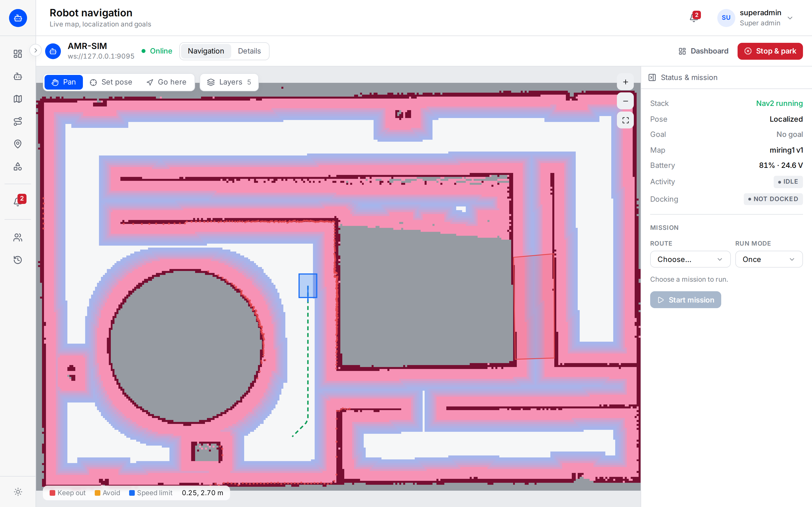
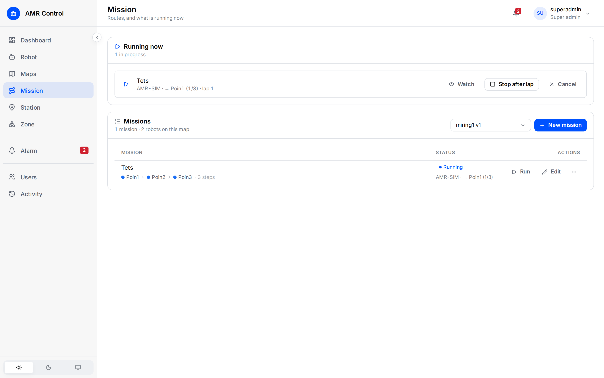
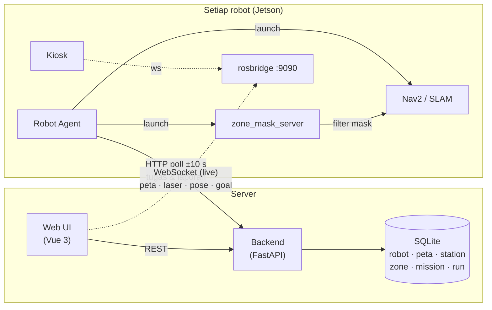

<div align="center">

# 🤖 AMR Control

**Web UI untuk mengelola armada robot AMR berbasis ROS 2** — peta, station, zone, mission,
dan pemantauan robot secara live, dilengkapi Robot Agent di setiap robot dan layar Kiosk.


</div>

---

## Daftar Isi

- [Tentang](#tentang)
- [Fitur](#fitur)
- [Arsitektur](#arsitektur)
- [Struktur Repository](#struktur-repository)
- [Menjalankan Secara Lokal](#menjalankan-secara-lokal)
- [Konfigurasi](#konfigurasi)
- [Robot Agent](#robot-agent)
- [Kiosk](#kiosk)
- [Pengujian](#pengujian)
- [Deployment Produksi](#deployment-produksi)
- [Dokumentasi](#dokumentasi)
- [Status & Batasan](#status--batasan)

---

## Tentang

AMR Control adalah satu tempat untuk mengoperasikan robot AMR (Autonomous Mobile Robot):
mendaftarkan robot, membuat dan merapikan peta, menandai titik tujuan, menggambar area
larangan, menyusun rute, menjalankan mission, dan memantau hasilnya — untuk satu robot
maupun satu armada.

Sistem terdiri dari tiga bagian:

| Bagian | Berjalan di | Peran |
|---|---|---|
| **Web UI + Backend** (`new_webui/`) | Server | Antarmuka operator dan *registry* (database) seluruh armada |
| **Robot Agent** (`amr_agent/`) | Setiap robot (mis. Jetson) | Menjalankan apa yang diatur di Web UI: Nav2/SLAM, peta, station, zone, mission |
| **Kiosk** (`kiosk-mockup/`) | Layar di robot | Tampilan untuk orang di sekitar robot (mockup) |

> **Prinsip utama:** browser tidak "menyetir" mission. Web UI menyimpan apa yang harus dikerjakan
> ke backend; robot sendiri yang mengambil dan melaksanakannya. Menutup browser tidak menghentikan robot.

---

## Fitur

### 🧭 Navigasi live

Peta live, posisi dan laser robot, rute yang direncanakan, costmap, dan zone — lengkap dengan
**Set pose**, **Go here**, **Cancel goal**, dan tombol **Stop** (batalkan goal + mission + parkir robot).

<table>
  <tr>
    <td width="50%"></td>
    <td width="50%"></td>
  </tr>
  <tr>
    <td align="center"><sub>Halaman navigasi: status, kartu mission, alat & layer peta</sub></td>
    <td align="center"><sub>Layer costmap: dinding dan zone keep-out terlihat sebagai area mahal/terlarang</sub></td>
  </tr>
</table>

### 🗺️ Peta

- **Mapping (SLAM)** — kemudikan robot dengan joystick di layar atau gamepad (dengan tombol *deadman*), lalu simpan peta.
- **Map editor** — brush, garis, kotak, fill, undo/redo; simpan sebagai **versi baru** (versi lama tetap aman).
- **Registry & versi** — upload `.yaml` + `.pgm/.png`, assign peta ke robot, rename, download.

<table>
  <tr>
    <td width="50%"></td>
    <td width="50%"></td>
  </tr>
  <tr>
    <td align="center"><sub>Daftar peta, versi, dan robot yang memakainya</sub></td>
    <td align="center"><sub>Map editor</sub></td>
  </tr>
</table>

### 📍 Station, 🚧 Zone & 📋 Mission

- **Station** — titik tujuan bernama dengan arah hadap: *Pick*, *Drop*, *Pick & drop*, *Charging*. Dibuat dengan klik di peta atau **Capture** dari posisi robot.
- **Zone** — poligon aturan area yang diterapkan ke Nav2:

  | Jenis | Perilaku robot |
  |---|---|
  | 🟥 **Keep out** | Dilarang masuk, dianggap dinding |
  | 🟧 **Avoid** | Dihindari bila ada jalan lain (tingkat keengganan 1–99) |
  | 🟦 **Speed limit** | Melambat sampai batas kecepatan di dalam area |
  | 🟪 **Trigger** | Menyalakan sinyal (lampu/buzzer) selama di dalam area |

- **Mission** — rute berurutan dari beberapa station; dijalankan **Once**, **Laps**, atau **Until stopped**,
  dengan kontrol *Stop after lap*, *Cancel mission*, dan *Cancel goal*.

<table>
  <tr>
    <td width="33%"></td>
    <td width="33%"></td>
    <td width="33%"></td>
  </tr>
  <tr>
    <td align="center"><sub>Station</sub></td>
    <td align="center"><sub>Zone keep-out</sub></td>
    <td align="center"><sub>Daftar mission</sub></td>
  </tr>
</table>

### 📊 Pemantauan armada & notifikasi

- **Dashboard** — semua robot sekaligus, robot bermasalah di atas (*Needs attention*), status Nav2/SLAM, mode **Working / Parked / Surveying**, tombol **Park / Release**.
- **Robot details** — kesehatan setiap topic ROS (OK / Waiting / Stale), frekuensi, terakhir diterima.
- **Notifikasi** — pop-up dan catatan di lonceng 🔔 / halaman **Alarm** setiap robot tiba di station, mission selesai, gagal, atau dibatalkan.
- **Marker mission di peta** — setiap step tampil bernomor: hijau = selesai, biru = tujuan sekarang, putih = belum.

<table>
  <tr>
    <td width="50%"></td>
    <td width="50%"></td>
  </tr>
  <tr>
    <td align="center"><sub>Dashboard armada</sub></td>
    <td align="center"><sub>Kesehatan topic robot</sub></td>
  </tr>
</table>

---

## Arsitektur



| Jalur | Isi |
|---|---|
| **Browser → Backend** (REST) | Semua data yang dibuat operator: robot, peta, station, zone, mission, run |
| **Agent → Backend** (HTTP, robot yang menarik) | Peta & mode yang diminta, station, zone, run; laporan step / tiba / selesai |
| **Browser ↔ Robot** (rosbridge) | Hanya data *live*: peta, laser, pose, costmap, rute, serta *Set pose* / *Go here* |

Robot yang **menarik** data (bukan server yang mendorong), sehingga robot tetap bekerja walau
berada di belakang NAT atau berpindah access point WiFi.

---

## Struktur Repository

```
ros2-software-amr/
├── new_webui/
│   ├── frontend/          Vue 3 + Vite + TypeScript + Tailwind + Pinia + roslib
│   │   └── src/
│   │       ├── app/        shell, router, koneksi ROS (pool), notifikasi run
│   │       ├── features/   dashboard, robot, maps, mapping, missions, stations, zones, alarm
│   │       ├── domain/     tipe data & logika ROS (TF, status, topic health)
│   │       └── shared/     komponen UI, API client
│   ├── backend/           FastAPI + SQLite
│   │   ├── app/            api/, repositories/, schemas/, migrations/
│   │   └── tests/          pytest
│   └── deploy/            contoh konfigurasi nginx produksi
├── amr_agent/             Robot Agent (di-copy ke setiap robot)
│   ├── robot_agent_node.py   agent utama (rclpy)
│   ├── agent_state.py        "ingatan" offline: registry, station, zone, outbox
│   ├── backend_client.py     klien HTTP ke backend
│   ├── zone_mask_server.py   zone → mask filter Nav2
│   └── run_agent_gprp.sh     peluncur agent
├── kiosk-mockup/          mockup layar robot (HTML/CSS/JS statis)
├── docs/                  panduan PDF, runbook produksi, kontrak ROS, screenshot
└── DESIGN.md              design system yang diikuti Web UI
```

---

## Menjalankan Secara Lokal

### Prasyarat

- **Python 3.12+** (backend)
- **Node.js 20+** dan npm (frontend)
- Robot atau simulasi ROS 2 dengan **rosbridge** di port 9090 (untuk data live)

### 1. Backend — `http://localhost:3002`

```bash
cd new_webui/backend
python3 -m venv .venv
./.venv/bin/pip install -e ".[dev]"
cp .env.example .env
./.venv/bin/python -m app --reload
```

Migrasi database berjalan otomatis saat start. Dokumentasi API: `http://localhost:3002/docs`.

### 2. Frontend — `http://localhost:3100`

```bash
cd new_webui/frontend
npm install
cp .env.example .env
npm run dev
```

### 3. Tambahkan robot

Buka `http://localhost:3100` → **Robot** → **Add robot**, isi nama dan alamat rosbridge
(mis. `ws://192.168.2.133:9090`), lalu jalankan [Robot Agent](#robot-agent) di robot dengan ID yang ditampilkan.

---

## Konfigurasi

### Backend — `new_webui/backend/.env`

| Variabel | Default | Keterangan |
|---|---|---|
| `AMR_DB_PATH` | `./data/amr.db` | Lokasi database SQLite |
| `AMR_MAPS_DIR` | `./data/maps` | Lokasi file peta |
| `AMR_HOST` / `AMR_PORT` | `0.0.0.0` / `3002` | Alamat server |
| `AMR_CORS_ORIGINS` | `http://localhost:3100` | Origin browser yang diizinkan (pisahkan dengan koma) |
| `AMR_ENV` | `development` | `production` menolak start bila CORS tidak aman |

### Frontend — `new_webui/frontend/.env`

| Variabel | Contoh | Keterangan |
|---|---|---|
| `VITE_API_BASE_URL` | `http://localhost:3002/api` | Alamat API. Kosong = `/backend/api` (same-origin di balik nginx) |
| `VITE_API_STATIC_URL` | `http://localhost:3002` | Alamat file statis backend |
| `VITE_DEFAULT_ROS_URL` | `ws://localhost:8765` | Isian awal form *Add robot* |
| `VITE_DEFAULT_CAMERA_PORT` | `8080` | Port stream kamera default |

---

## Robot Agent

Program kecil di setiap robot yang menjadi penghubung antara Web UI dan robot.

**Yang dilakukan setiap ±10 detik:**

1. Membaca registry: peta yang ditugaskan dan mode yang diminta (*Working / Parked / Surveying*).
2. Mengirim laporan yang tertunda (bila sebelumnya offline).
3. Mengunduh & memverifikasi peta (hash), menyimpannya di cache robot.
4. Menyalakan/mematikan Nav2 atau SLAM sesuai mode; `zone_mask_server` ikut menyala bersama Nav2.
5. Menyimpan station & zone ke disk robot dan meneruskan zone ke Nav2.
6. Mengambil dan menjalankan mission, melaporkan setiap step, tiba, selesai, gagal, atau batal.

**Tahan server mati:** robot menyimpan "ingatan" di `~/amr_agent/state/` —
boot dari registry & peta cache bila server tidak terjangkau, laporan masuk antrean dan dikirim
berurutan saat koneksi kembali, dan run yang sudah selesai tidak pernah dijalankan dua kali.

### Instalasi di robot

```bash
# dari komputer pengembang
ssh user@ip-robot 'mkdir -p ~/amr_agent'
scp amr_agent/*.py amr_agent/*.sh user@ip-robot:~/amr_agent/

# di robot: rosbridge, lalu agent
ros2 launch rosbridge_server rosbridge_websocket_launch.xml port:=9090
~/amr_agent/run_agent_gprp.sh <robot-id> http://<ip-server>:3002
```

> `run_agent_gprp.sh` saat ini disetel untuk simulasi **Isaac Sim** (`*_sim_launch.py`, `use_sim_time:=true`).
> Robot fisik memerlukan paket launch-nya sendiri dan `use_sim_time_arg:=false`.

### Banyak robot

Setiap robot menjalankan agent sendiri dengan **robot ID unik**, rosbridge sendiri, dan sebaiknya
**`ROS_DOMAIN_ID` berbeda**. Banyak robot boleh memakai versi peta yang sama — station dan zone
peta itu otomatis berlaku untuk semuanya. Satu robot menjalankan satu mission pada satu waktu.

---

## Kiosk

Tampilan layar robot untuk orang di sekitarnya: wajah robot animasi, tujuan perjalanan, dan
layar **"Pesanan Anda sudah tiba"** dengan tombol konfirmasi besar.

<table>
  <tr>
    <td width="33%"></td>
    <td width="33%"></td>
    <td width="33%"></td>
  </tr>
  <tr>
    <td align="center"><sub>Siap</sub></td>
    <td align="center"><sub>Mengantar</sub></td>
    <td align="center"><sub>Tiba — tunggu konfirmasi</sub></td>
  </tr>
  <tr>
    <td width="33%"></td>
    <td width="33%"></td>
    <td width="33%"></td>
  </tr>
  <tr>
    <td align="center"><sub>Terhalang</sub></td>
    <td align="center"><sub>Mengisi daya</sub></td>
    <td align="center"><sub>E-STOP</sub></td>
  </tr>
</table>

Coba langsung: buka `kiosk-mockup/index.html` di browser, tekan **`D`** untuk panel simulasi
(tombol 1–9 mengganti layar), atau tekan lama pojok kiri atas untuk menu staf (PIN mockup `1234`).

> Kiosk saat ini **mockup** dengan data simulasi. Rencana integrasinya: membaca status dari agent lewat
> rosbridge lokal dan memanggil `/mission_confirm` saat tombol konfirmasi ditekan.

---

## Pengujian

```bash
# backend
cd new_webui/backend && ./.venv/bin/python -m pytest

# frontend
cd new_webui/frontend
npm test            # unit test (Vitest)
npm run typecheck   # vue-tsc
npm run lint        # ESLint
npm run build       # build produksi
```

---

## Deployment Produksi

Web UI dan backend berjalan di **server** di balik nginx (satu origin, prefix `/backend/`),
sedangkan setiap robot menjalankan agent dan rosbridge. Panduan lengkap — port, contoh nginx,
systemd service, dan perilaku saat jaringan putus — ada di
[`docs/runbooks/PRODUCTION_DEPLOYMENT.md`](docs/runbooks/PRODUCTION_DEPLOYMENT.md).

```bash
cd new_webui/frontend
cp .env.production.example .env.production
npm run build        # → dist/, disajikan nginx (new_webui/deploy/nginx.conf.example)
```

---

## Dokumentasi

| Dokumen | Isi |
|---|---|
| 📘 [`docs/Panduan_AMR_Web_UI.pdf`](docs/Panduan_AMR_Web_UI.pdf) | Panduan pengguna lengkap (35 halaman): setiap halaman UI, Robot Agent, multi-robot, Kiosk, troubleshooting |
| 🚀 [`docs/runbooks/PRODUCTION_DEPLOYMENT.md`](docs/runbooks/PRODUCTION_DEPLOYMENT.md) | Deployment server + robot |
| 🔌 [`docs/ROS_INTERFACE_CONTRACT.md`](docs/ROS_INTERFACE_CONTRACT.md) | Topic, service dan action antara Web UI dan robot |
| 🎨 [`DESIGN.md`](DESIGN.md) | Design system Web UI |

---

## Status & Batasan

- ✅ Web UI, backend, Robot Agent, notifikasi mission, zone ke Nav2, dan agent tahan server mati sudah berjalan dan teruji.
- 🧪 Kiosk masih **mockup**; aksi *Pick/Drop* dan *Wait for confirm* belum dijalankan di robot simulasi.
- 🔒 Backend dan rosbridge **belum memakai login** — jalankan di jaringan tertutup/VPN.
- 🚦 Robot belum saling berkoordinasi (tidak ada pengaturan lalu lintas antar robot); penugasan mission masih manual.
- 🐢 Pada jaringan lambat, posisi robot di UI bisa tertinggal; perbaikan sudah dianalisa dan direncanakan.
